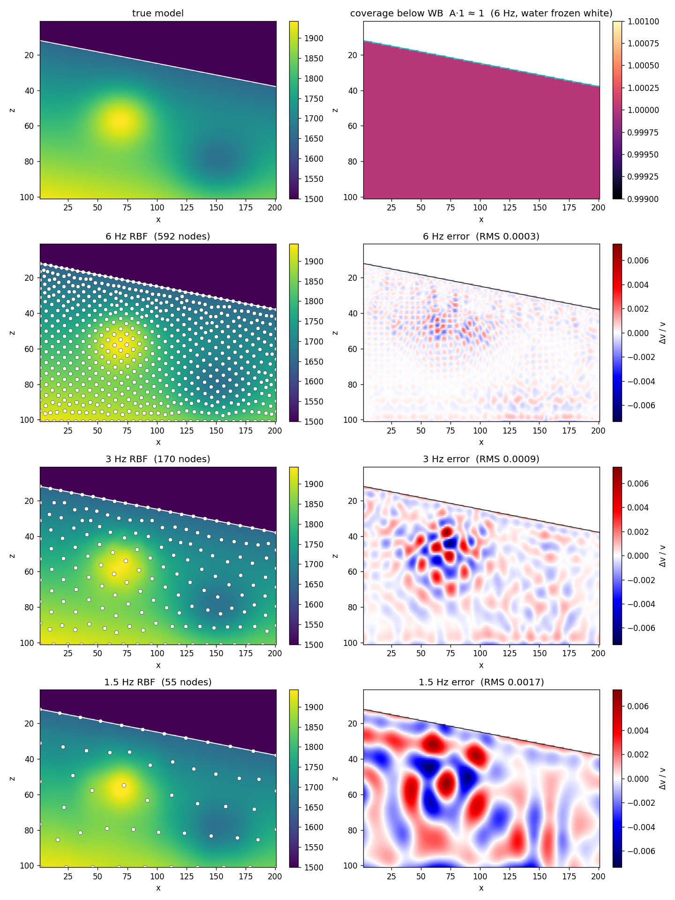
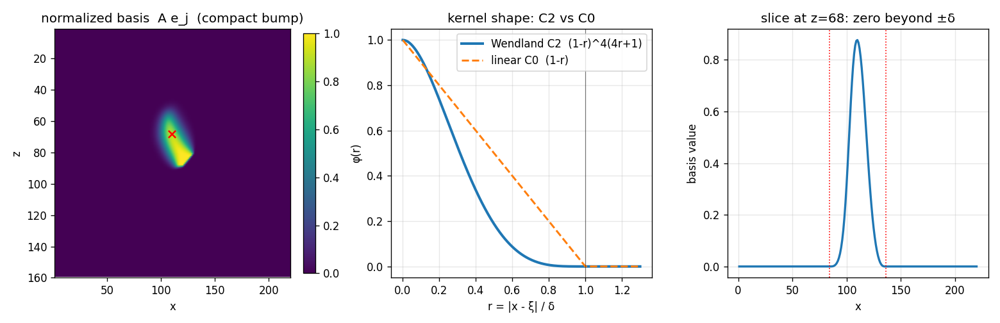
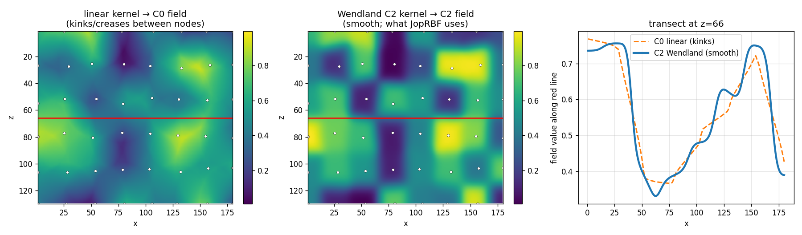

# JopRBF: scattered-node model parameterization for JetPack

`JopRBF` maps a small set of scattered control-node coefficients to a regular fine
model grid using **normalized compact-support radial basis functions** (Wendland
C2). It is a reduced (coarse) model parameterization for `Jets` inverse problems
(FWI dimension reduction, regularization, preconditioning), with an exact adjoint
and a matrix-free implementation that scales to very large grids (for example
1000^3).

This directory holds the operator's demo scripts and the figures below. The demos
use a local project (`docs/JopRBF/Project.toml`) that adds PyPlot and Gmsh
alongside a dev'd JetPack, so those plotting/meshing dependencies stay out of
JetPack itself:

```
julia --startup-file=no --project=docs/JopRBF -t 8 docs/JopRBF/JopRBF_waterbottom_demo.jl   # water-bottom comparison figure
julia --startup-file=no --project=docs/JopRBF -t 8 docs/JopRBF/JopRBF_demo.jl               # kernel / smoothness figures
```

## The operator

$$
d(x) = \frac{\sum_j \varphi\!\left(r_j(x)\right)\, c_j}{\sum_j \varphi\!\left(r_j(x)\right)},
\qquad
r_j(x) = \sqrt{\sum_k \left(\frac{x_k - \xi_{j,k}}{\delta_{k,j}}\right)^2}
$$

$$
\varphi(r) = (1-r)^4\,(4r+1)\ \text{ for } 0 \le r < 1, \qquad \varphi(r) = 0 \text{ otherwise (Wendland C2).}
$$

Here $c$ are the node coefficients (the optimization variables), $\xi_j$ the node
locations (in fine-grid index coordinates), and $\delta$ the compact-support
radius. It may be a scalar, a per-axis vector (for anisotropic grids), or a
per-node $\delta_{k,j}$ matrix, so each node can carry its own support radius.
Properties, each a unit test in `test/jop_RBF.jl`:

- **Compact support, so it scales.** $\varphi$ vanishes for $r \ge 1$, so each
  fine point only sees the $O(1)$ nodes within $\delta$. The forward and adjoint
  are applied matrix-free with a node bucket index (no dense $N_\text{fine}\times M$
  matrix is formed). The forward threads over fine points and gathers nearby
  nodes; the adjoint threads over nodes and walks each node's fine-grid box. Both
  enumerate the identical set of (fine point, node) pairs, so the adjoint is exact.
- **C2 smooth, no hot zones.** $\varphi$, $\varphi'$ and $\varphi''$ all vanish at
  $r = 1$, so the field is twice continuously differentiable (no bilinear-style
  creases).
- **Reproduces constants.** The Shepard normalization is a partition of unity.
- **No overshoot.** $\varphi \ge 0$, so the field is a convex combination of
  nearby coefficients and stays within their min and max (no ringing / halos).
- **Build once, reuse.** The node bucket index and the normalization field
  $1/\sum_j\varphi$ depend only on the node positions and $\delta$; they are
  computed once at construction and reused for every apply. There is no linear
  solve.

### API

```julia
# nodes are a (ndims(range) x M) matrix in fine-grid index coordinates
A = JopRBF(JetSpace(Float64, M), JetSpace(Float64, nz, nx), nodes; delta = 20.0)
d = A * rand(domain(A))                       # coarse coefficients -> fine model
g = A' * rand(range(A))                        # adjoint -> gather to nodes

# anisotropic support (per axis)
A = JopRBF(JetSpace(Float32, M), JetSpace(Float32, nz, nx, ny), nodes3; delta = [30.0, 50.0, 50.0])

# per-node support radii (ndims x M): small support shallow, large support deep
A = JopRBF(JetSpace(Float64, M), JetSpace(Float64, nz, nx), nodes; delta = deltas)
```

## Water-bottom "freeze" workflow

The scattered nodes make it natural to parameterize only the sediment below a
(possibly dipping) water bottom while freezing the water column.

1. Get the water-bottom depth `wb(x)` (for example from `water_bottom_index`).
2. Mesh the sediment below the water bottom with [Gmsh](https://gmsh.info) using a
   size field $h(z) = \lambda(z)/\text{ppw}(z)$ with $\lambda(z) = v(z)/f$, so the
   node spacing follows a points-per-wavelength rule (denser where the wavelength
   is short). The water bottom is embedded as a boundary curve, so mesh vertices
   land on it, and the mesh vertices are used as the RBF centers. Gmsh runs from
   the demo's local project, not from JetPack.
3. Build the reduced parameterization operator as a composition:

   ```julia
   A  = JopRBF(JetSpace(T, M), JetSpace(T, nz, nx), nodes; delta)
   S  = JopDiagonal(Float64.(below))      # 1 below the water bottom, 0 in the water
   P  = S ∘ A                             # reduced parameterization (a JopLn)
   ```

4. The full model is the frozen water plus the RBF sediment:
   $v(c) = v_\text{water} \cdot (\text{water mask}) + P\,c$.

   In FWI you invert for $c$. The reduced gradient is $A'$ applied to the masked
   fine-grid gradient ($P' = A' S'$), so the water column is never updated: the
   freeze is automatic because there are no nodes in the water and `S` zeros the
   water rows. To start from a given sediment model, fit the coefficients once,
   `c = P \ vec(v_start .* below)`, then invert. Bounds and regularization now act
   on the few hundred coefficients `c` instead of every fine sample, and the
   sediment is smooth (C2) and free of overshoot by construction.

**Figure 1**, produced by
[`JopRBF_waterbottom_demo.jl`](JopRBF_waterbottom_demo.jl), shows this on a 101×201
model with a sloping water bottom, comparing three inversion frequencies (lower
frequency $\Rightarrow$ longer wavelength $\Rightarrow$ coarser mesh). Row 1: the
true model, and the partition-of-unity coverage below the water bottom (water shown
white). Rows 2-4: the frozen-water + RBF parameterization at 6, 3 and 1 Hz (mesh
nodes overlaid) next to the signed relative error $\Delta v/v$ (red/blue, shared
color scale). Node counts follow the size field: 6 Hz ≈ 737 nodes (0.0003 RMS),
3 Hz ≈ 207 (0.0008), 1 Hz ≈ 34 (0.0075) below-WB relative error. The 1 Hz case is
coarse because its wavelength exceeds the model depth (Gmsh meshes to the size
field; it does not add points to fit the data).



## Kernel and smoothness

**Figure 2** shows a single normalized basis function (a compact bump), the
Wendland C2 kernel next to a C0 linear "tent" kernel, and a slice confirming the
basis is exactly zero beyond $\pm\delta$.



**Figure 3** explains why the C2 kernel matters. Both panels interpolate the *same*
coefficients on the *same* coarse node cloud (white dots), differing only in the
kernel. The linear "tent" kernel gives a **C0** field (continuous value but
discontinuous slope) with visible creases/kinks between nodes; the Wendland kernel
gives a smooth **C2** field (continuous value, slope, and curvature), which is what
`JopRBF` uses. The transect along the red line (right) makes it explicit: the C0
profile kinks at node boundaries, the C2 profile is smooth. Those C0 kinks are the
"hot zones" a piecewise-linear (bilinear or barycentric) parameterization produces
between nodes.



## Why this design

- **Global RBF** (thin-plate, multiquadric) has dense interpolation matrices and
  global support, so it does not scale to 1000^3.
- **Triangulation plus C1 cubic** (Clough-Tocher) is local and smooth but needs a
  3D Delaunay mesh and fragile C1 macro-elements.
- **Barycentric-linear on a mesh** is cheap but only C0, which reintroduces the
  creases / hot zones.

Normalized compact-support RBF keeps locality (scales), is C2 (no hot zones), is
meshless (no 3D triangulation), reproduces constants, and does not overshoot.

## Tests

`test/jop_RBF.jl`: Wendland C2 kernel (value and first/second derivatives vanish
at the support edge, non-negative); dot-product (adjoint) tests in 1D/2D/3D;
partition of unity; compact support (influence vanishes beyond $\delta$); no
overshoot (convex combination); anisotropic per-axis $\delta$; per-node
(multiresolution) $\delta$; Float32.
